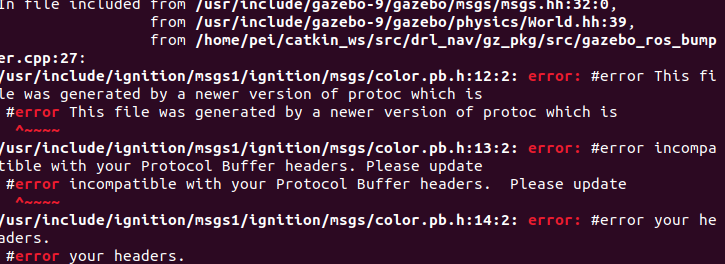

## Minimal package of 9tian simulation platform

与仿真无关的内容不要提交到这里！！

### Usage

```
roslaunch robot_gazebo start_basic.launch

# 如果需要使用hdl定位
roslaunch robot_gazebo start_basic.launch hdl:=true
```

* 传感器设置

sensor_parameters.yaml

### Issue
**gazebo11与Protobuf冲突问题**

终端输入
```
protoc --version
```
检查输出是否为libprotoc 3.6.1
如果小于这个版本，则gazebo会与protobuf冲突
- 方案一
  
  多个版本protobuf共存。你的不一致的版本的google-protobuf的头文件默认是安装在 /usr/local/include, 所以我们新安装的可以指定在 /usr/include，或者你喜欢的地方。

  最后我们把3.6版本的头文件链接到原来的地方。

  cd /usr/local/include 
  
  sudo mv google google-<your version> 
  
  sudo ln -s /usr/include/google ./google
- 方案二(彻底解决)
  ```
  sudo apt-get remove libprotobuf-dev
  sudo apt-get remove protobuf-compiler
  sudo apt-get remove python-protobuf
  sudo rm -rf /usr/local/bin/protoc
  sudo rm -rf /usr/bin/protoc
  sudo rm -rf /usr/local/include/google
  sudo rm -rf /usr/local/include/protobuf*
  sudo rm -rf /usr/include/google
  sudo rm -rf /usr/include/protobuf*
  ```
  然后可能会把ros给卸载一部分
  ```
  sudo apt-get update
  sudo ldconfig
  sudo apt-get install libprotobuf* protobuf-compiler python-protobuf
  sudo apt install ros-noetic-desktop-full
  ```
